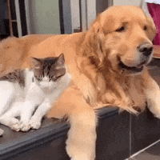

<h2 align ="center"> Seja bem-vindo! </h2>

- 💻 Desenvolvido por Álvaro Ribeiro e Laura Pivoto 

  

Nesse projeto você encontra um PetShop completo para atender seu gatinho ou cachorrinho! 

# Para testar, não esquecer de dar drop na primeira vez que for dar o run no workbench!

# Autores

| [ Laura Pivoto Ambrósio](https://github.com/LauraPivoto)  |  [ Álvaro Lúcio Ribeiro](https://github.com/AlvaroLucioRibeiro) |
| :---: | :---: |

